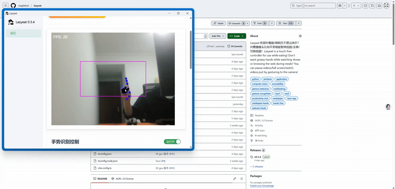
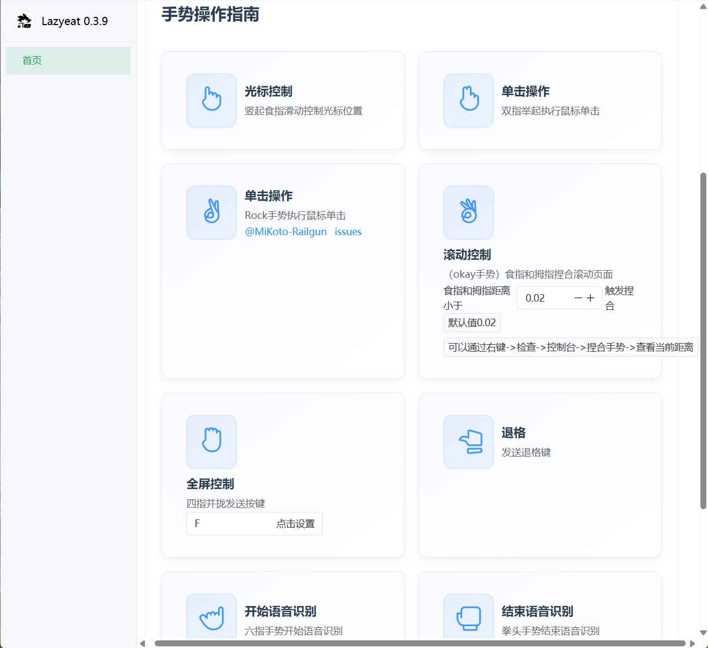

# 🍕 LazyEat


**LazyEat** 是一个免触控操作工具，让你在吃饭时也能轻松控制视频播放和网页浏览，只需对着摄像头比划手势即可实现暂停视频、全屏、切换视频等功能！


## 🌟 特性

- 🖐️ 单指滑动控制光标
- ✌️ 双指/Rock 执行鼠标单击
- 👌 OK 手势控制页面滚动
- 🤏 四指并拢发送按键
- 🎤 支持语音输入
- 🚀 跨平台支持 (Windows & macOS)



## 📸 截图


<div align="center">

</div>

## 🧠 工作原理

- 采用 **前后端分离架构设计开发**，基于 **Vue 3** + **Tauri** + **FastAPI** 构建完整的桌面应用解决方案；
- 系统核心功能拆分为：手势识别服务、语音控制服务、系统操作服务、用户界面服务；
- 基于 **MediaPipe Tasks Vision** 实现高精度手部关键点检测，通过 **WebAssembly** 在浏览器中实时处理视频流；
- 采用 **WebSocket** 技术实现前后端实时双向通信，确保手势指令的低延迟响应；
- 利用 **Vosk 语音识别引擎** 实现离线语音指令识别，支持本地部署保障用户隐私；
- 基于 **Tauri 插件系统** 构建系统级操作接口，支持跨平台的鼠标键盘控制和窗口管理；
- 支持 **多线程异步处理**，通过 **Python asyncio** 实现高并发的 WebSocket 连接和指令处理；
- 采用 **模块化设计**，便于维护和扩展。

## 🔁 工作流程

- 用户启动 LazyEat 应用，系统初始化摄像头和 WebSocket 通信服务；
- 前端通过 MediaPipe WASM 实时捕获并识别用户手势，包括单指、双指、OK 手势等；
- 识别到的手势数据通过 WebSocket 实时传输到后端 Python 服务；
- 后端服务解析手势指令并将其转换为对应的系统操作指令，如鼠标移动、点击、滚动等；
- Tauri 插件接收指令并调用操作系统 API 执行相应操作，实现免触控控制；
- 同时，系统持续监听语音输入，通过 Vosk 语音识别引擎将语音转换为文本指令；
- 语音指令经过处理后同样转换为系统操作，与手势控制形成互补的操作方式；
- 整个流程支持热插拔，用户可随时启用或禁用手势/语音控制功能。
## 🚀 快速开始

### 系统要求

```
Python 3.11.x
Rust 1.85.1+
Node.js v22.14.0+
```

> ⚠️ 注意：Python 3.12.7 及以上版本目前打包会失败

### 安装依赖

1. 安装 [Rust](https://www.rust-lang.org/zh-CN/tools/install) 和 [Node.js](https://nodejs.org/zh-cn/)

2. 在项目根目录执行安装命令：
```bash
npm run install-reqs
```

3. 构建 Tauri 图标：
```bash
npm run build:icons
```

### 语音识别模型

下载 [Vosk 中文语音识别小模型](https://alphacephei.com/vosk/models/vosk-model-small-cn-0.22.zip) 并解压到 `model/` 文件夹下。

### 开发环境运行

```bash
npm run tauri dev
```

### 打包应用

1. 使用 PyInstaller 打包 Python 后端：
```bash
# Windows
npm run build:py

# macOS
# npm run build:py-mac

# Linux
# npm run build:py-linux
```

2. 打包成生产环境应用：
```bash
npm run tauri build
```

打包后的可执行文件位于 `src-tauri/target/release` 目录下。

## 📦 技术栈

- **前端**: Vue 3 + TypeScript + Vite + Element Plus
- **后端**: Python + FastAPI + Vosk + OpenCV
- **桌面框架**: Tauri 2.x
- **手势识别**: MediaPipe Tasks Vision
- **通信**: WebSocket

## 📢 语音识别模型替换

- [小模型 (推荐)](https://alphacephei.com/vosk/models/vosk-model-small-cn-0.22.zip) - 适用于一般场景
- [大模型](https://alphacephei.com/vosk/models/vosk-model-cn-0.22.zip) - 识别准确率更高

将下载的大模型解压并替换 `model/` 目录下的内容即可。


